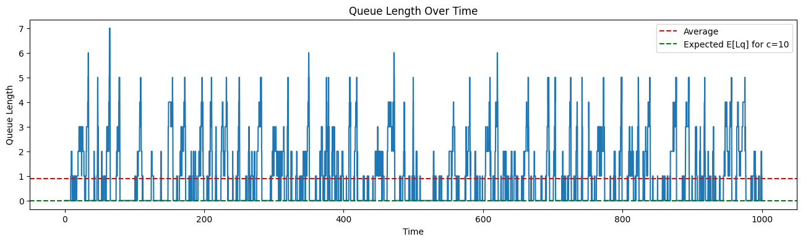
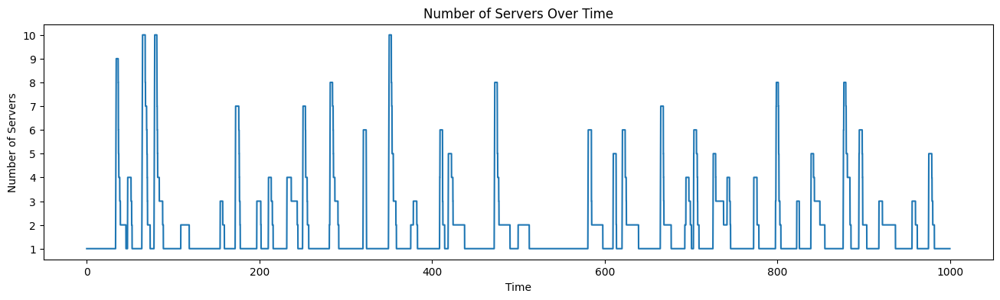
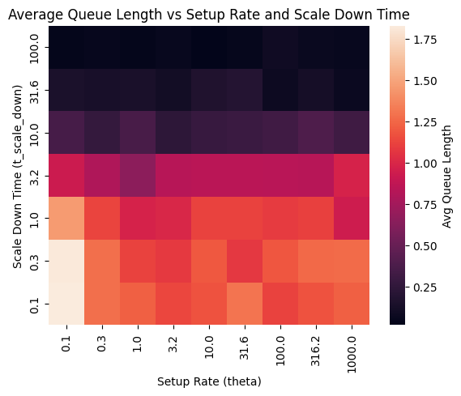
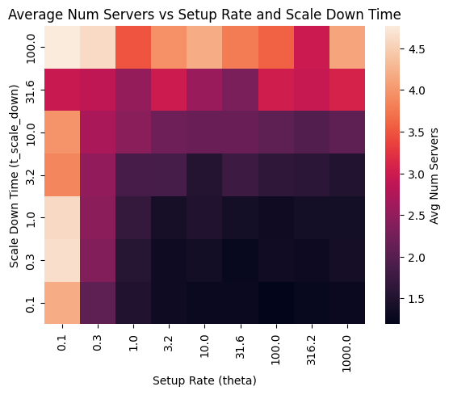

# cluster-autoscaler-queue
☁️☕ Assignment for analysis of M/M/c queue with setup time

## Project Description

This project analyzes the M/M/c queue with setup time, focusing on cloud cluster autoscaling scenarios. It models how servers are activated and deactivated based on incoming workload, considering the time required to set up new servers.

## Features

- Simulation of queueing processes with multiple servers
- Visualization of queue states and server setup times
- Analytical results and performance metrics

## Visual Overview

### Single simulation run results

### Analysis of scale down time and setup time impact 

#### Conclusions

Increasing the scale-down time $t_{scale\_down}$ has a positive impact on the average queue length, resulting in shorter queues as $t_{scale\_down}$ increases. In contrast, the setup rate $\theta$ does not significantly affect the queue length. However, both higher setup rates and longer scale-down times lead to a lower average number of active servers in the system, improving resource efficiency. This demonstrates that tuning these parameters can help balance performance and cost in autoscaled clusters.
